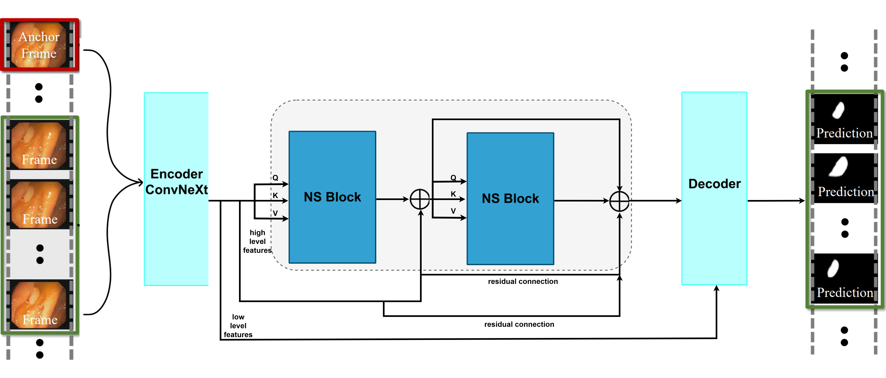

# Speed-Performance Balance in Constrained Attention-based Models for Endoscopy Video Sequences

This is the repository for the paper "Speed-Performance Balance in Constrained Attention-based Models for Endoscopy Video Sequences", based on the one from the [PNS+](https://github.com/GewelsJI/VPS).

<p align="center">
    
</p>

>
>
### Dataset
>
Instructions for setting up the dataset in [`DATA_PREPARATION`](https://github.com/GewelsJI/VPS/blob/main/docs/DATA_PREPARATION.md), including instructions for accessing the [SUN-database](http://amed8k.sundatabase.org).
>
### Training
>
For training use this script:
>
```shell
python my_train.py
```
>
### Testing
>
For testing first use the script from below to get the images, then use the toolbox from the `/eval` directory:
>
```shell
python my_eval.py --pth_path [path_to_weights]
```